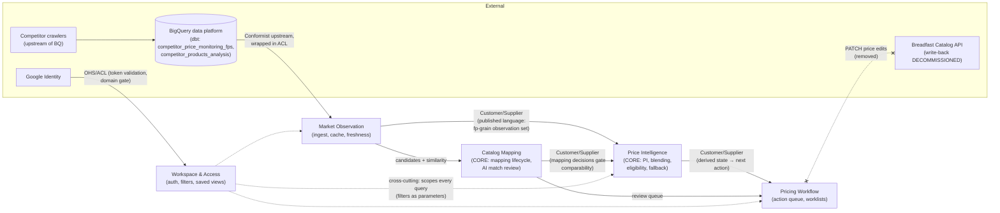
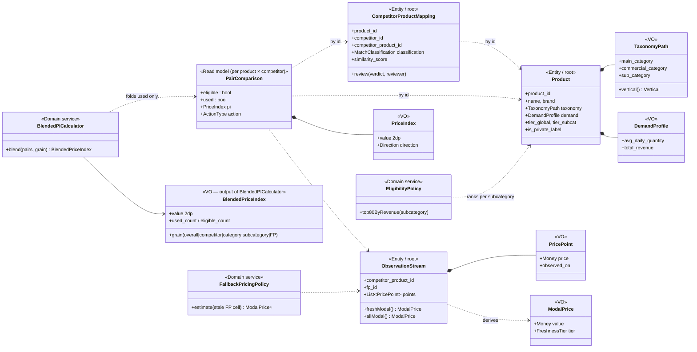

# Domain-Driven Design — Breadfast Pricing Intelligence Tool

Strategic and tactical domain model for the competitive-pricing product. Grounded in the
codebase as of `main@de56d49` (file references point at real code). Two readings are kept
side by side throughout:

- **Target model** — the domain as DDD would carve it.
- **As implemented** — where each concept actually lives today (a read-model-centric
  FastAPI monolith whose policies are largely encoded in SQL).

---

## 1. Ubiquitous language

The one-line-per-term contract. If a PR uses one of these words differently, the PR is wrong.

| Term | Definition |
|---|---|
| **Price Index (PI / sale_PI)** | Breadfast sale price ÷ competitor sale price for one comparable pair. 1.00 = parity; "both tails cost money" (cheap = margin left, pricey = demand risk). |
| **Blended PI** | Quantity-weighted aggregate: `Σ(sale_PI × avg_daily_quantity) / Σ(avg_daily_quantity)` over **used** products only. Computable at any grain (overall, competitor, category, subcategory, FP). |
| **Fulfillment point (FP)** | A Breadfast dark store. The finest comparison grain: prices are observed and compared per FP × competitor. |
| **Product** | A Breadfast catalog item (`product_id`), carrying taxonomy, brand, tier, and demand stats (`avg_daily_quantity`, `total_revenue`). |
| **Competitor product** | An item crawled from a competitor's catalog (`competitor_product_id`), with its own 3-level category taxonomy (`category_level_1/2/3`). |
| **Mapping** | The asserted equivalence between a Product and a Competitor product for one competitor (`is_mapped`). The unit of comparability. |
| **Classification** | Mapping status label: Mapped / Potential match / No likely match / Confirmed no match. |
| **Similarity score** | AI match confidence ∈ [0,1]; ≥ 0.85 promotes an unmapped pair into human review. |
| **Match potential** | An AI-suggested candidate mapping awaiting review (`match_potential`, `match_potential_product_name`). |
| **Price observation (crawl)** | One competitor price seen at one FP on one day (`competitor_sale_price`, `competitor_last_updated_day`). |
| **Modal price** | The most-frequent price across an observation set (ties → lowest). Robust to one-off promos and bad scrapes. |
| **Fresh / Outdated** | Freshness of an observation vs. the recency policy (`is_recent_competitor` / `is_recent_breadfast`). Outdated prices are shown, never blended. |
| **Estimated (≈)** | Opt-in fallback: a mapped-but-stale **FP cell** filled from the pair's *fresh* modal elsewhere. FP-grain only; if a pair has only stale prices anywhere it stays **outdated**, never estimated. |
| **Eligible** | Product in the top 80% of its subcategory's revenue — worth tracking competitively. |
| **Used** | Eligible ∧ mapped ∧ fresh competitor modal exists (∧ BF modal exists). Only used products feed a Blended PI. |
| **Action type** | The single next step for a (product, competitor) pair: Needs Mapping / Review AI Match / Needs Price for FP / Needs Price Update / Complete. |
| **Vertical** | Business split: **Beauty** ⇔ `main_category_name = 'Fragrances & Beauty'`; everything else **Supermarket**. |
| **Commercial category** | The commercial org's taxonomy (`commercial_category_name`). **This is what the app's "Categories" filter and the category roll-up mean by "category".** |
| **Main category** | The storefront taxonomy (`main_category_name`). Distinct from commercial category; source of the Vertical. |
| **Tier (global / subcat)** | Revenue-importance banding of products, globally and within a subcategory. |
| **Private label (PL)** | Breadfast own-brand products; excludable because they have no like-for-like competitor price. |
| **Sync** | A pull of the two source tables from BigQuery, gated by change detection on their last-modified metadata. |

---

## 2. Strategic design

### 2.1 Subdomains

| Subdomain | Type | Why |
|---|---|---|
| **Price intelligence** (PI computation, blending, eligibility/used gating, freshness & fallback policy, verticals, geographic exposure) | **Core** | The defensible number is the product. Weighting by real demand + integrity gates ("a figure you can't trust is worse than no figure") is the competitive advantage. |
| **Catalog mapping & match review** (mapping lifecycle, AI suggestions, classification) | **Core** | The denominator's integrity. Wrong mappings poison every PI downstream; the AI-assisted review loop is proprietary judgment. |
| **Market observation** (crawled prices, freshness, crawl coverage, sync/change detection) | Supporting | Necessary raw material, but crawling/dbt modeling lives upstream in the data platform; this tool curates and caches. |
| **Pricing workflow** (action queue, revenue-prioritized worklists, staleness heatmap) | Supporting | Turns intelligence into work; valuable but derivable from the core model. |
| **Workspace** (filters, saved views, URL sharing, exports) | Generic | Standard analytics-UX machinery. |
| **Identity & access** (Google sign-in, domain restriction) | Generic | Commodity; delegated to Google. |

### 2.2 Bounded contexts

| Context | Responsibility | Owns the words | As implemented |
|---|---|---|---|
| **Market Observation** | Ingest the two BigQuery tables, translate them into domain shapes, detect change, cache (parquet), answer "how fresh is our picture?" | observation, crawl, sync, fresh/stale (of *data*), coverage | `bigquery_service.py` load queries, `latest_bq_modified` (`services/__init__.py:7`), parquet cache, `/api/data-status`, `/api/refresh-now`, competitor-products endpoints |
| **Catalog Mapping** | The mapping lifecycle: candidate → reviewed → mapped / confirmed-no-match; AI suggestion surfacing | mapping, classification, similarity, match potential, review | `competitor_products_analysis` rows, match-review queue (`master_data.py:61`), classification donut |
| **Price Intelligence** | Compute PI/Blended PI at every grain under the eligibility, freshness, and fallback policies; verticals; exposure | PI, blended PI, eligible, used, modal, estimated, vertical, parity | `_BASE_CTE` + aggregations in `duckdb_service.py`, commercial/executive routers |
| **Pricing Workflow** | Derive the next action per pair, prioritize by revenue impact, track completion | action type, worklist, needs-X, complete | `action_type` CASE (`duckdb_service.py:415`), master-data router, top-actions |
| **Workspace & Access** | Auth (Google, `@breadfast.com`), filter state, saved views, exports | view, filter, snapshot | `auth.py`, Pinia stores, `SavedViews.vue` (localStorage), export endpoints |

**Same word, different meaning across contexts** (translation required at the boundary):

- **"Fresh"** — Market Observation: *the crawl* is recent. Price Intelligence: *the price feeding a PI* passes the recency gate. A pair can have fresh crawls at one FP and be stale at another.
- **"Category"** — Catalog Mapping speaks the *competitor's* taxonomy (`category_level_1/2/3`); Price Intelligence speaks Breadfast's (commercial category / subcategory). Never join them by name.
- **"Mapped"** — Catalog Mapping: an equivalence was asserted. Price Intelligence: merely a precondition; mapped ≠ comparable (needs a price) ≠ used (needs eligible + fresh).

### 2.3 Context map

**The ACL at the BigQuery boundary is deliberate.** The source tables are dbt models owned by
another team; their column names, sentinel values (`1970-01-01` = never crawled,
filtered at `bigquery_service.py:129`), and refresh cadence are *their* language. The load
queries + `_BASE_CTE` re-derivations (`is_recent_*`, `used_product`, `action_type` recomputed
locally rather than trusted from source) are the anti-corruption layer: upstream schema drift
should break one translation seam, not every aggregate. Today that ACL is thin (column
pass-through with re-derivation); the design intent is that **no context downstream of Market
Observation ever names a raw BQ column**.

**Catalog API (decommissioned):** the write-back client (`catalog_client.py`, analysts PATCHing
`nowPrice`/`nowSalePrice` to catalog.breadfast.com) was removed; `/catalog/enrich` survives as a
no-op (`commercial.py:287`). The context map keeps the seam marked because "act where you
analyze" (PRODUCT.md) implies price write-back returns someday — it should re-enter through
Pricing Workflow, not through Price Intelligence.

---

## 3. Tactical design

### 3.1 Aggregates

Aggregates are chosen by *what must be transactionally consistent*, and kept small — cross-
aggregate references are by identity only.

| Aggregate (root) | Context | Boundary protects | Contents |
|---|---|---|---|
| **CompetitorProductMapping** — root `Mapping(product_id, competitor_id)` | Catalog Mapping | *At most one active mapping per (product, competitor); legal review transitions; "Confirmed no match" is terminal.* | classification, similarity score, match-potential candidate (VO), review decision + reviewer + timestamp |
| **ObservationStream** — root `(competitor_product_id, fp_id)` | Market Observation | *Append-only price history per competitor product per FP; freshness is derived, never stored as fact.* | list of `PricePoint` VOs (price, observed_on) |
| **Product** — root `product_id` | shared kernel (Catalog Mapping ↔ Price Intelligence) | *Identity + descriptive facts change atomically.* | name, brand, `TaxonomyPath` VO, tiers, demand stats (`DemandProfile` VO), PL flag |
| **ActionItem** — root `(product_id, competitor_id)` | Pricing Workflow | *One current action per pair; Complete only via the domain rule, not by edit.* | `ActionType` VO, revenue-impact priority, derivation inputs snapshot |
| **WorkspaceView** — root `view name` | Workspace | *A snapshot applies atomically or not at all.* | `FilterSnapshot` VO |

**Deliberately *not* aggregates:**

- **PriceIndex / BlendedPI** — pure computations over other aggregates' state. They are **value
  objects produced by domain services** (read model), never stored with identity. Persisting a
  blended PI would invite it to drift from its inputs.
- **Eligibility** — "top 80% of subcategory revenue" is a *ranking across products*, so no single
  Product aggregate can enforce it. It's a **policy** (domain service) evaluated over the set.
- **FP** — reference data (identity + name), an entity but nobody's root.

*As implemented:* none of these exist as objects — the whole tactical layer is projected into
one denormalized read model (`_BASE_CTE` produces the per-(product, competitor) aggregated
state at `duckdb_service.py:281+`, over the fp-grain parquet). That is a legitimate CQRS
read side; the aggregate design above is the write-side model to grow into if/when mapping
review and price write-back become in-app commands instead of upstream dbt facts.

### 3.2 Entities vs value objects

| Concept | Kind | Invariants |
|---|---|---|
| Product, CompetitorProduct, Mapping, FP, ActionItem | **Entity** | identity-equality |
| **PriceIndex** | VO | ratio > 0; renders at exactly 2dp (`toFixed(2)`, computed at 4dp); carries `Direction` (cheaper/parity/pricier vs the ±0.05 band) and the ▼◆▲ glyph |
| **Money / Price** | VO | amount ≥ 0, currency EGP; no bare floats crossing context lines |
| **PricePoint** | VO | (Money, observed_on); immutable once observed |
| **ModalPrice** | VO | most-frequent over a non-empty observation set; ties break low; records which set (fresh-only vs all) it was taken over |
| **FreshnessTier** | VO (enum) | fresh / estimated / outdated — `estimated` legal **only** via the fallback policy, never asserted directly |
| **MatchClassification** | VO (enum) | Mapped / Potential match / No likely match / Confirmed no match |
| **ActionType** | VO (enum) | the five states; derived, never user-assigned |
| **Vertical** | VO (enum) | Beauty ⇔ main_category_name = 'Fragrances & Beauty'; else Supermarket; exhaustive |
| **TaxonomyPath** | VO | (main category, commercial category, subcategory) — one unit; the two "category" axes never mix |
| **DemandProfile** | VO | (avg_daily_quantity ≥ 0, total_revenue ≥ 0); the blending weight |
| **FilterSnapshot** | VO | complete filter state; applying is atomic (`applySnapshot`, `filters.js`) |

### 3.3 Domain rules (invariants the model must enforce)

1. **The used gate:** `used ⇔ eligible ∧ mapped ∧ BF modal exists ∧ fresh competitor modal exists` (`duckdb_service.py:411-414`). Nothing else may feed a Blended PI.
2. **Blending excludes the un-used, but never hides it:** non-used products stay in denominators and counts (eligible/needs-action) — dropped from the *verdict*, not from *visibility*.
3. **Outdated is never blended.** A stale price is displayable, flagged, and excluded.
4. **Estimated is fresh-derived, FP-grain, opt-in, and marked.** Fallback fills a stale FP cell only from the same pair's *fresh* modal elsewhere; a pair with only stale prices everywhere is outdated, never estimated. Estimates always render with the ≈ flag.
5. **Eligibility is a set-level policy:** top 80% of subcategory revenue, recomputed on data change — never hand-edited per product.
6. **One active mapping per (product, competitor);** "Confirmed no match" is terminal and removes the pair from action queues without deleting history.
7. **Action type is a pure function** of mapping + price state (the CASE at `duckdb_service.py:415-427`): unmapped ∧ similarity < 0.85 → *Needs Mapping*; unmapped ∧ ≥ 0.85 → *Review AI Match*; mapped ∧ no price at all → *Needs Price for FP*; mapped ∧ fresh modal → *Complete*; else → *Needs Price Update*. It is derived state — no one "sets" it.
8. **PI presentation:** 2 decimal places everywhere; hue encodes the both-tails-bad scale exclusively (owned by `utils/piColor.js`); ▼◆▲ glyphs accompany color (colorblind-safe).
9. **Weighting is by real demand** (`avg_daily_quantity`) — one-SKU-one-vote aggregation is forbidden.
10. **Access:** every non-public API call carries a Google token whose `aud` matches this app and whose email ends `@breadfast.com` (`auth.py:70-75`). There are no finer roles (yet).

### 3.4 Domain events

| Event | Raised by | Consumed by | Today |
|---|---|---|---|
| `SourceDataSynced { tables, modified_at }` | Market Observation | PI, Mapping, Workflow (recompute); Workspace (refresh badge, refetch options) | `data-status` polling + `data-updated` emit (`AppHeader.vue`) |
| `PriceObserved { competitor_product, fp, price, day }` | Market Observation | PI (modal recompute), Workflow | implicit in sync batch |
| `FreshnessDegraded { pair, fp }` | Market Observation (clock-driven) | PI (used-gate re-eval), Workflow (Needs Price Update) | recomputed on read |
| `MatchSuggested { pair, similarity }` | Catalog Mapping (AI, upstream) | Workflow (review queue) | rows with match_potential |
| `MappingReviewed { pair, verdict, reviewer }` | Catalog Mapping | PI (comparability change), Workflow | happens upstream in dbt; in-app review is the natural next command |
| `PriceIndexRecomputed { grain, value }` | Price Intelligence | Executive trend (WoW), alerting (future) | recomputed on read; WoW endpoint approximates |
| `EligibilityRecalculated { subcategory }` | Price Intelligence policy | Workflow (queue re-prioritization) | recomputed in-query |
| `ActionCompleted { pair }` | Pricing Workflow | Executive coverage KPIs | derived when the CASE lands on Complete |

The as-implemented system is **event-less**: every "event" above is currently a re-derivation
on read. That is fine at this scale; the catalog matters because any future push-style feature
(alerts, digests, audit of mapping decisions) should be named in this language.

### 3.5 Repositories & domain services

**Repositories (one per aggregate root):** `MappingRepository`, `ProductRepository`,
`ObservationStreamRepository` (append-only), `ActionItemRepository`, `WorkspaceViewRepository`.
*As implemented:* all reads funnel through one `PricingDataServiceInterface`
(`data_interface.py`) with three interchangeable backends (DuckDB / BigQuery-pandas / mock) —
effectively a single coarse read-model repository. The interface is the seam to split along.

**Domain services (logic owned by no single aggregate):**

| Service | Rule it owns | Today |
|---|---|---|
| `BlendedPICalculator` | quantity-weighted blend at any grain | `used_agg` CTEs (`duckdb_service.py:459+`), `get_fp_competitor_pi` |
| `EligibilityPolicy` | top-80% revenue per subcategory | upstream flag `eligible_product`, honored in gates |
| `FreshnessPolicy` | recency thresholds; fresh/outdated verdicts | `is_recent_*` flags + re-derivations |
| `FallbackPricingPolicy` | when a stale FP cell may borrow the fresh modal (rule 4) | `price_fallback` param path (FP-matrix, geo exposure) |
| `ModalPriceService` | most-frequent-price reduction, tie-break low | `comp_fresh_modal` / `comp_all_modal` (`duckdb_service.py:391`) |
| `ActionDerivationPolicy` | the action CASE (rule 7) | `duckdb_service.py:415`, `utils/calculations.py:5` |
| `VerticalPolicy` | Beauty/Supermarket split (rule in one place, not scattered) | WHERE clause + pandas branch (`duckdb_service.py`) |

---

## 4. Core-context aggregate diagram (Price Intelligence + its suppliers)

---

## 5. Open questions / assumptions

Assumptions made where the domain is underspecified — the top items to validate with a domain
expert (commercial lead + data platform owner):

1. **Where should mapping decisions live?** Today mapping/classification are upstream dbt facts;
   the app only *reviews visually*. If "Review AI Match" is to become an in-app command (approve/
   reject persisted), CompetitorProductMapping becomes this system's first real write aggregate —
   who is the system of record then, this tool or the warehouse?
2. **Freshness thresholds are implicit.** `is_recent_*` arrives precomputed from BQ; the tool
   re-derives some flags. The actual number-of-days policy should be named in one place
   (FreshnessPolicy) and owned by a context, not split between dbt and SQL.
3. **Eligibility (top-80%) is assumed recomputed upstream per sync.** If it's ever computed
   in-app, it must stay a set-level policy, and its churn (products flapping in/out at the
   boundary) may deserve an event + WoW annotation.
4. **Price write-back is assumed to return.** The removed Catalog client implies a future
   "correct the price from the tool" command. Modeled as belonging to Pricing Workflow (a
   `PriceChangeRequested` command + ACL to the Catalog API), never as a side effect inside
   Price Intelligence.
5. **Vertical is defined by exactly one main category.** Confirm 'Fragrances & Beauty' is the
   complete Beauty perimeter (Personal Care / Health & Wellness currently count as Supermarket).
6. **No RBAC.** Everyone at `@breadfast.com` sees everything, including the confidential blended
   PI. If leadership wants tiered access, Workspace & Access grows a real authorization model.
7. **WoW/trend endpoints recompute rather than store.** If historical PI series become a product
   feature (beyond week-over-week), `PriceIndexRecomputed` events should be persisted as a
   time series instead of re-deriving from the current snapshot.
8. **Saved views are per-browser** (localStorage). Sharing beyond copy-link implies a backend
   `WorkspaceViewRepository`.
